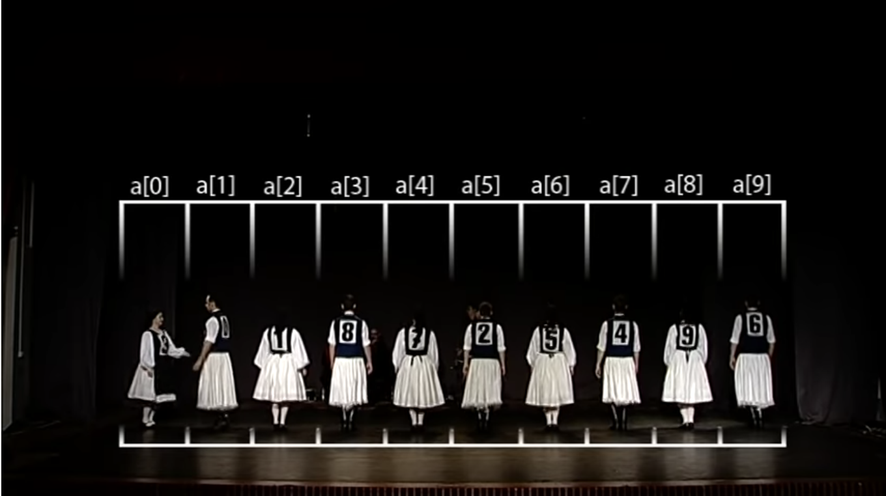

# Insertion Sort

**Insertion Sort** is an algorithm which moves elements one at a time into the correct position. The algorithm consists of inserting one element at a time into the previously sorted part of the array, moving higher ranked elements up as necessary.

[Quick Video](https://www.youtube.com/watch?v=OGzPmgsI-pQ)

[Visualization](https://visualgo.net/en/sorting)

### Worst Case Time Complexity: O(N2)

As the length of the array grows has to make N2 comparisons

Not efficient on reversed data sets.

`let arr = [5,4,3,2,1]`

### Best Case Time Complexity: O(N)

Only has to run through a nearly sorted array one time making a simple comparison at each index.

`let arr = [1,2,3,4]`

### Pseudocode

  1. start by picking the second element in the array.
  2. compare second element with the one before it and swap if needed.
  3. contuine to the next element(-1) and if not in the correct order iterate over the sorted portion to place the element in the correct place.
  4. repeat until the array is sorted.

### Resources

[Insertion Sorting JS](https://dev.to/ryan_dunton/insertion-sorting-for-beginners-in-js------fkg)

[Rosettacode](https://rosettacode.org/wiki/Sorting_algorithms/Insertion_sort)
